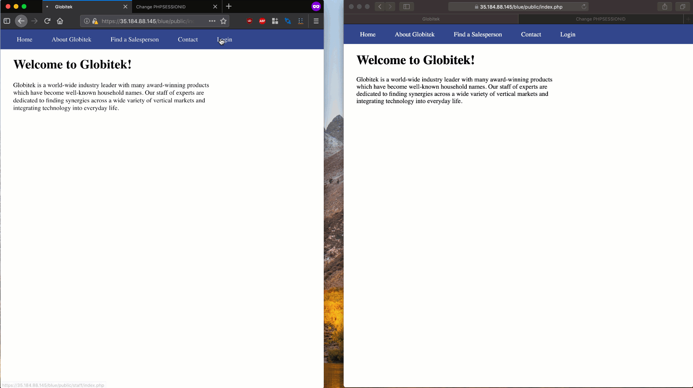
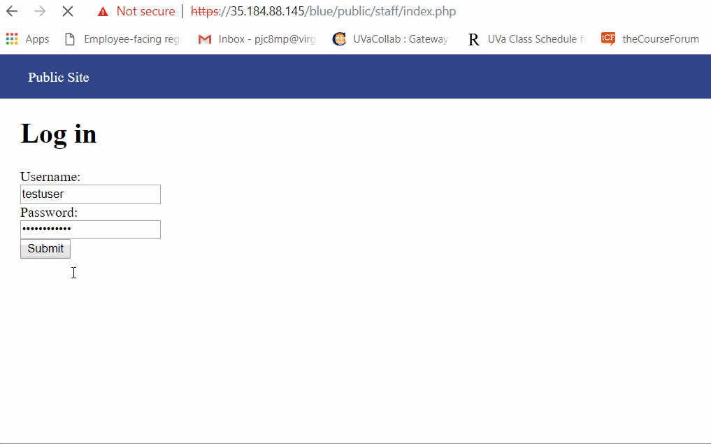
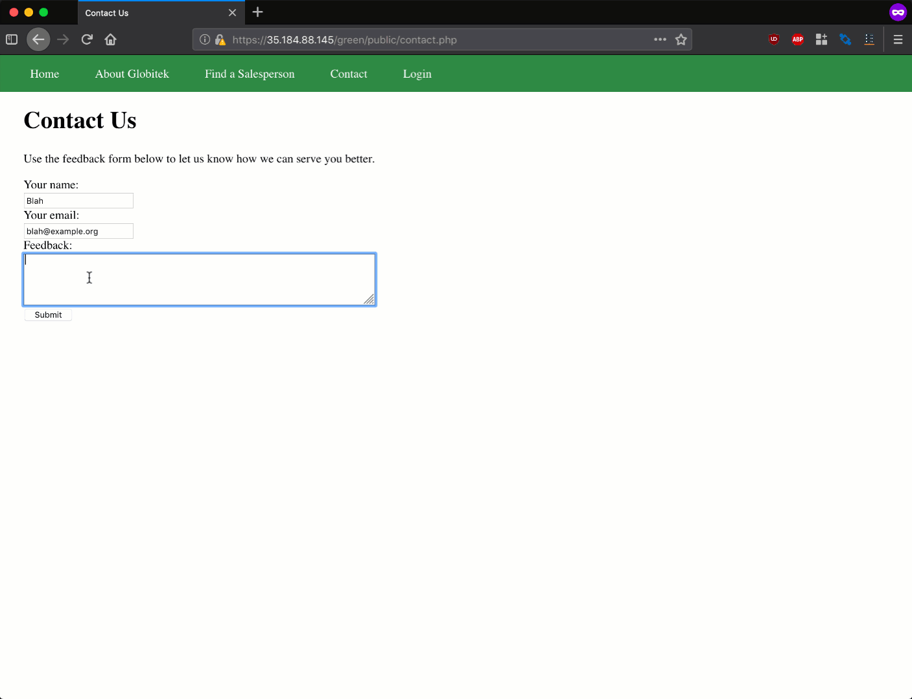
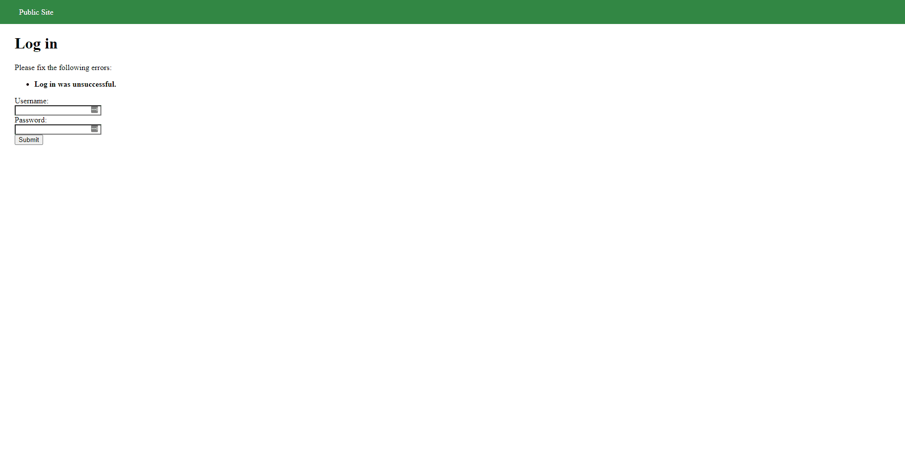
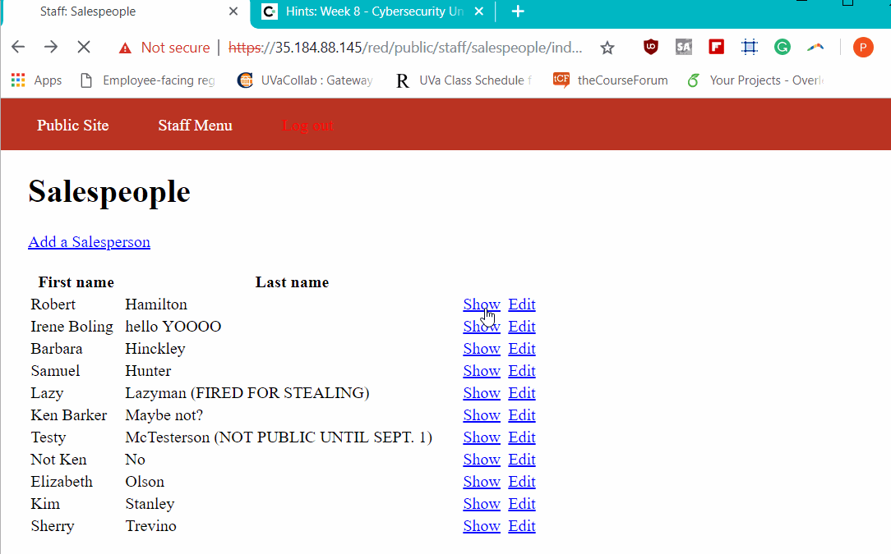
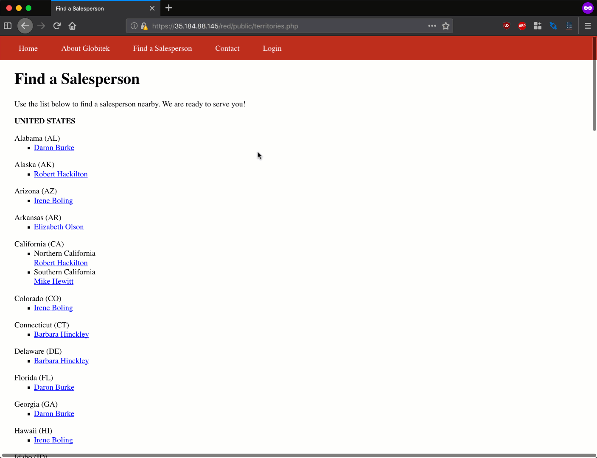

# Project 8 - Pentesting Live Targets

Time spent: **8** hours spent in total

> Objective: Identify vulnerabilities in three different versions of the Globitek website: blue, green, and red.

The six possible exploits are:

* Username Enumeration
* Insecure Direct Object Reference (IDOR)
* SQL Injection (SQLi)
* Cross-Site Scripting (XSS)
* Cross-Site Request Forgery (CSRF)
* Session Hijacking/Fixation

Each color is vulnerable to only 2 of the 6 possible exploits. First discover which color has the specific vulnerability, then write a short description of how to exploit it, and finally demonstrate it using screenshots compiled into a GIF.

## Blue

Vulnerability #1: Session Hijacking

Description:
The blue site is vulnerable to hijacking attacks. Using the supplied public/hacktools/change_session_id.php tool, a session created in one browser was successfully used in a different

Vulnerability #2: SQL Injection

Description:
On the salesperson page, when you look through all the employee's page in the URL you notice how they all have id=__ . By replacing the ___ with ' OR SLEEP(5)=0--'. The URL's ending changes to %27%20OR%20SLEEP(5)=0--%27. The page then refreshes for a couple of seconds than loads to Daron Burke.

## Green

Vulnerability #1: Cross-Site Scripting

Description:
The green site's contact form (found at /green/public/contact.php) allows arbitrary JavaScript to be submitted and later executed by authenticated users in the administration interface (found at /green/public/staff/feedback/index.php).

For example, submitting the following JavaScript in the "Feedback" field of the contact form will lead to a JavaScript alert appearing when feedback is viewed by an authenticated user.

Vulnerability #2: User Enumeration

Description:
We know that jmonroe99 and pperson are valid usernames and if you incorrectly type the password you receive an error message "Log in was unsuccessful" is bolded. However, when you try to submit in a username that is not valid like uname the error message is not bolded.

## Red

Vulnerability #1: Cross-Site Request Forgery (CSRF)

Description:
We can trick the admin into opening a blank page in the feedback that contains a hidden malicious link.

Vulnerability #2: Insecure Direct Object Reference (IDOR)

Description:
The red site is vulnerable to an IDOR attack, as inactive salespeople's detail pages are accessible by altering the value of the id GET parameter in the URL /red/public/salesperson.php?id=. Other versions of the site redirect requests for non-public salesperson profiles back to the general public listing of salespeople.

## Notes

Describe any challenges encountered while doing the work
