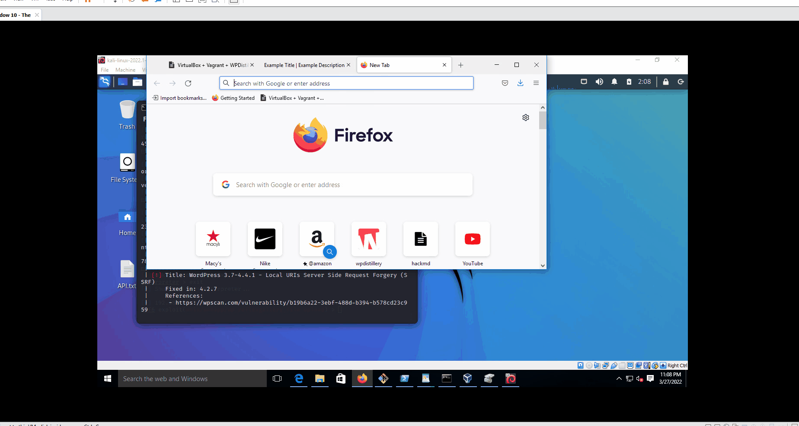

# Project 7 - WordPress Pentesting

Time spent: **5** hours spent in total

> Objective: Find, analyze, recreate, and document **five vulnerabilities** affecting an old version of WordPress

## Pentesting Report

### 1. (Required) CVE-2017-5611: SQL Injection Vulnerability
  - [ ] Summary: 
    - Vulnerability types: SQL Injection Vul
    - Tested in version: WordPress 4.2
    - Fixed in version: WordPress 4.7.2
  - [ ] GIF Walkthrough: 
  - [ ] Steps to recreate:
   -  Navigate to the main page of WP
   -  Enter **or"1"="1** into the search box
  - [ ] Affected source code: **None**
### 2. (Required) CVE-2016-1564: Authenticated Cross-Site Scripting (XSS)
  - [ ] Summary: 
    - Vulnerability types: Authenticated Cross-Site Scripting (XSS)
    - Tested in version:4.2
    - Fixed in version: 4.4.1
  - [ ] GIF Walkthrough: 
  - [ ] Steps to recreate: 
    -  Navigate to the main page of WP
    -  Enter **http://thehoang.tech/<svg onload=alert('Youhavebeentricked')>** into the search box
  - [ ] Affected source code: Yes
### 3. (Required) Vulnerability Name or ID
  - [ ] Summary: 
    - Vulnerability types:
    - Tested in version:
    - Fixed in version: 
  - [ ] GIF Walkthrough: 
  - [ ] Steps to recreate: 
  - [ ] Affected source code:
    - [Link 1](https://core.trac.wordpress.org/browser/tags/version/src/source_file.php)
### 4. (Optional) Vulnerability Name or ID
  - [ ] Summary: 
    - Vulnerability types:
    - Tested in version:
    - Fixed in version: 
  - [ ] GIF Walkthrough: 
  - [ ] Steps to recreate: 
  - [ ] Affected source code:
    - [Link 1](https://core.trac.wordpress.org/browser/tags/version/src/source_file.php)
### 5. (Optional) Vulnerability Name or ID
  - [ ] Summary: 
    - Vulnerability types:
    - Tested in version:
    - Fixed in version: 
  - [ ] GIF Walkthrough: 
  - [ ] Steps to recreate: 
  - [ ] Affected source code:
    - [Link 1](https://core.trac.wordpress.org/browser/tags/version/src/source_file.php) 

## Assets

List any additional assets, such as scripts or files

## Resources

- [WordPress Source Browser](https://core.trac.wordpress.org/browser/)
- [WordPress Developer Reference](https://developer.wordpress.org/reference/)

GIFs created with [LiceCap](http://www.cockos.com/licecap/).

## Notes

Describe any challenges encountered while doing the work

## License

    Copyright [yyyy] [name of copyright owner]

    Licensed under the Apache License, Version 2.0 (the "License");
    you may not use this file except in compliance with the License.
    You may obtain a copy of the License at

        http://www.apache.org/licenses/LICENSE-2.0

    Unless required by applicable law or agreed to in writing, software
    distributed under the License is distributed on an "AS IS" BASIS,
    WITHOUT WARRANTIES OR CONDITIONS OF ANY KIND, either express or implied.
    See the License for the specific language governing permissions and
    limitations under the License.
